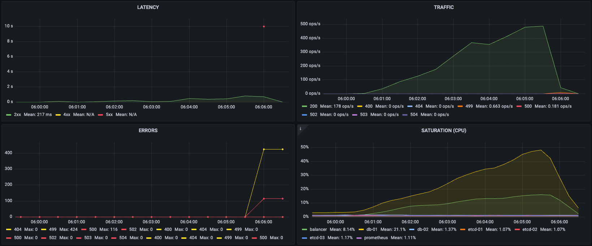
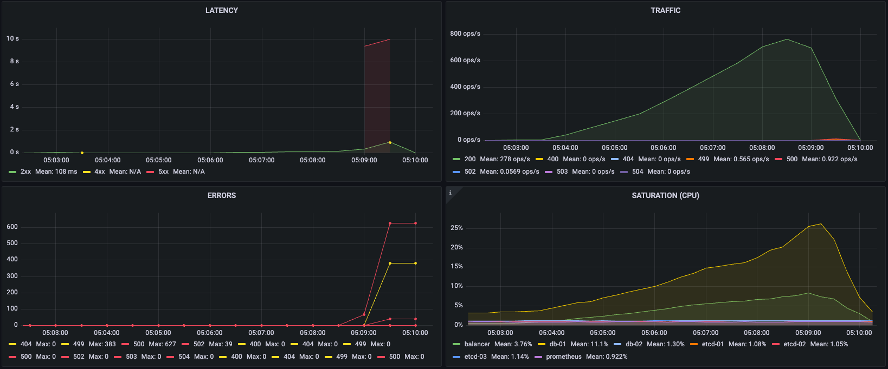
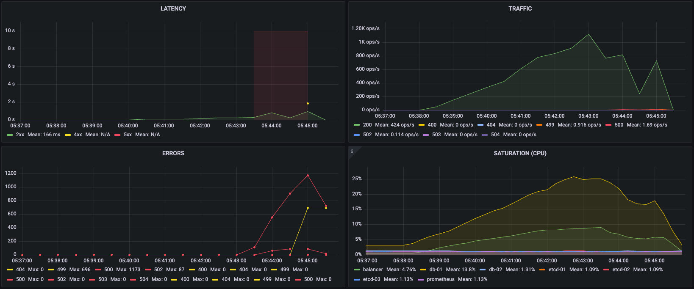

# Домашнее задание №3 по курсу "SRE: Cтратегия и методы" от МТС.Тета

## Идентификационные данные

Имя проекта: Проект для студента igor.shokhov

Namespace: sre-cource-student-114

## Описание

В этом репозитории содержатся скрипты для осуществления нагрузочного тестирования учебного проекта weather-api при помощи инструмента k6.

## Использование

### Предварительные шаги

Предварительно необходимо установить k6 на систему, с которой будет производиться нагрузочное тестирование. Самая полная и актуальная информация по установке доступна [в соответствующем разделе](https://k6.io/docs/get-started/installation/) офицальной документации.

### Запуск тестов

После установки склонируйте этот репозиторий и перейдите в директорию `k6-tests`:

`git clone https://github.com/Girag/sre-course-mts-teta-hw03.git && cd sre-course-mts-teta-hw01/k6-tests`

Здесь находятся две директории с тестами – `loadTests` и `stressTests`, которые содержат js-файлы с тестами соответствующего профиля нагрузки.

Пример команды запуска одного из тестов:

`k6 run loadTests/forecast.js`

## Результаты

### Требования по производительности и надёжности к системе

Учитывая специфику учебного проекта, представляющего из себя простой API погодного сервиса, были определены следующие показатели производительности и надёжности:

- SLO: 99,5% (максимальный процент ошибок для запросов не более 0,5% / время ответа по 99 перцентилю не более 800 мс).
- SLA: 99% (максимальный процент ошибок для запросов не более 1% / время ответа по 99 перцентилю не более 1 сек).

### Профили тестов

Были выбраны два профиля для написания собственных скриптов нагрузочного тестирования:

1. Плавная подача нагрузки в течение 10 минут с 0 до 1000 VUs и последующий graceful ramp down и graceful stop в течение 30 секунд на каждый. Установлены пороги отсечки в соответствии с обозначенными выше требованиями, по достижении которых тесты останавливаются. Эти тесты находятся в директории `loadTests`.
2. Стабильная нагрузка на протяжении всей работы теста (10 минут). Данные тесты размещены в директории `stressTests`.

В каждый тест было добавлено отображение справочной информации по 99 перцентилю, а также о точной дате/времени начала и окончания теста. Это может быть полезно для последующего анализа результатов по системам мониторинга.

### Максимальная производительность системы

Максимальная производительность системы довольно сильно варируется в зависимости от используемого эндпоинта и метода, а также текущего объёма хранимых в БД данных.

Наиболее тяжёлым оказался GET-запрос к /WeatherForecast, который отображает все прогнозы погоды по всем городам. Примерно на 480 RPS (6 минута плавного роста нагрузки) сервис начал отдавать 500 ошибки, превысив их допустимый процент, и стало ощутимо расти время ответа, вплотную приблизившись к обозначенному в требованиях значению:

Также нелегко пришлось учебному проекту при значительном количестве POST и PUT запросов к эндпоинтам /Cities и /Forecast. К концу 6 минуты и на ~650 RPS при массовых POST-запросах на /Cities появились 500 и 502 ошибки и время ответа перестало укладываться в допустимые рамки:

4 с половиной минуты и примерно 350 RPS POST и PUT запросов к /Forecast потребовалось для того, чтобы время ответа API-сервиса вышло за пределы определённых требованиями, но при этом ошибок он не отдавал:

GET-запросами на эндпоинт /Cities к началу 7 минуты на ~700 RPS проект стал немного подмешивать 500 ошибки к ответам и время ответа вышло за границу требований:

К концу 7 минуты GET-запросов на /Forecast на примерно 750 RPS время ответа сервиса пересекло пороговое, а также появились 500 и 502 ошибки:

## Выводы

В ходе выполнения нагрузочного тестирования нашего учебного проекта и анализа полученных результатов, были выявлены ключевые области для улучшения. Во-первых, была обнаружена неоптимальная реализация эндпоинтов WeatherForecast и Forecast. Их работа оказалась чрезмерно ресурсозатратной, с излишними обращениями к базе данных, что приводит к значительной нагрузке на вычислительные ресурсы и деградации производительности системы. Во-вторых, отсутствие автоматического масштабирования критично сказалось на обеспечении надёжности при увеличении нагрузки. Текущая реализация сервиса смогла бы продолжить корректную работу в рамках установленных требований, пусть и ценой повышенного потребления ресурсов.

В качестве первоначальных мер можно увеличить текущие лимиты и настроить автоматическое масштабирование (или увеличить количество реплик приложения). Но в долгосрочной перспективе стоит произвести рефакторинг самого приложения, пересмотрев реалзиацию указанных эндпоинтов. Также стоит рассмотреть возможность внедрения механизмов кеширования для сервиса и оптимизации БД.
